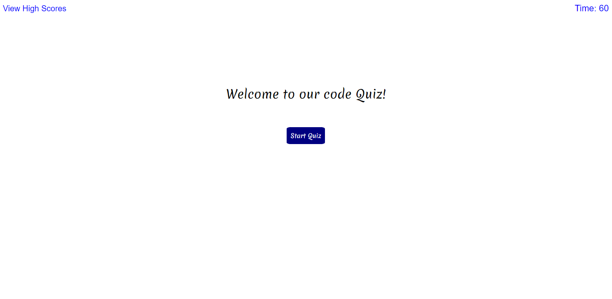
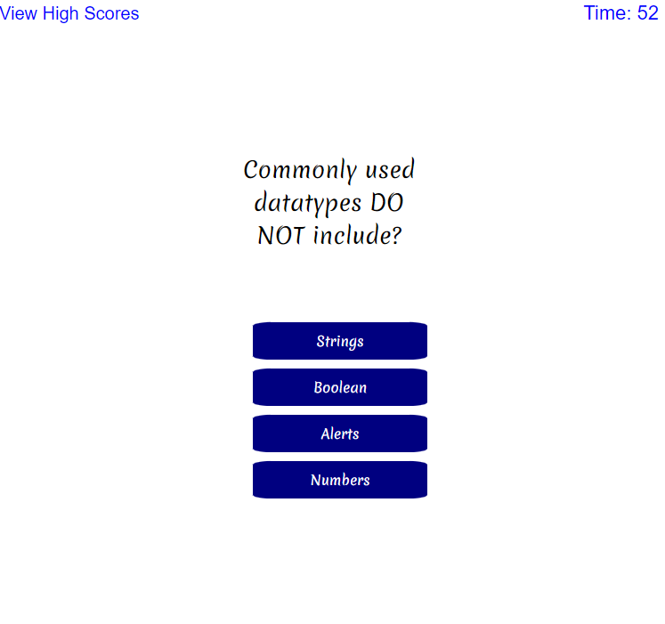
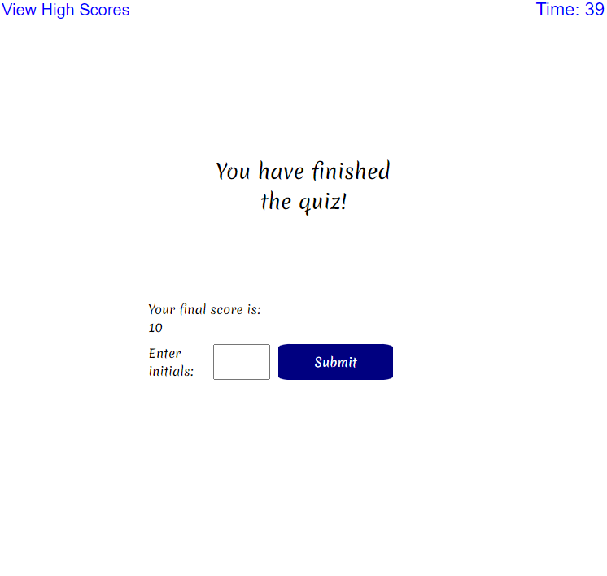

## Professional Readme Generator

## Description:
This is a coding quiz to test how well you now simple coding ideas. It takes your answers, remembers what you answer, knows if it's right or wrong, then stores all as a score. Also stores high scores in local storage.

GIVEN I am taking a code quiz
WHEN I click the start button
THEN a timer starts and I am presented with a question
WHEN I answer a question
THEN I am presented with another question
WHEN I answer a question incorrectly
THEN time is subtracted from the clock
WHEN all questions are answered or the timer reaches 0
THEN the game is over
WHEN the game is over
THEN I can save my initials and score

## Images:

## Additional Info:
Github: Asimone13
Email: alecsimone2@gmail.com